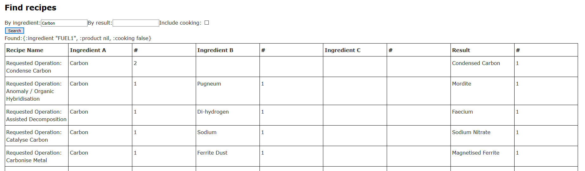

# Atlas sandbox

"No Man Sky" recipe book and file indexer


## Indexer

Use MXML language, substance and product NMS files to create
lookups for recipes and ingredients.

All parsing is done before-hand and stored as edn files for
consumption on web ui. See edn files in ```resources/public/```

XML parsing isn't ideal at this point in time and some stuff is
still fail xpath lookups.

## Recipe book UI

Simple Reagent table with filters. Still under construction/design.

Iteration 2 design screenshot:
